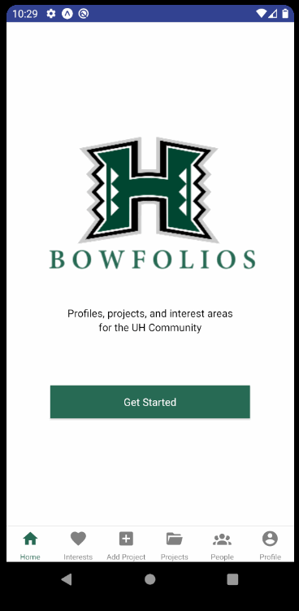
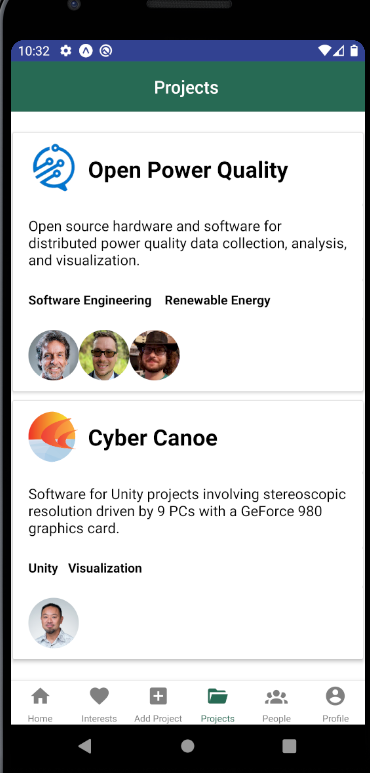
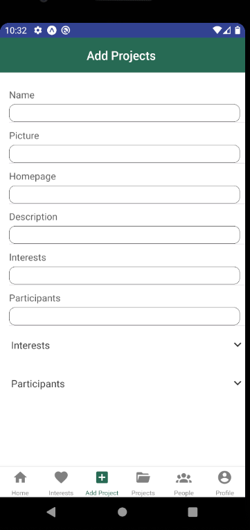
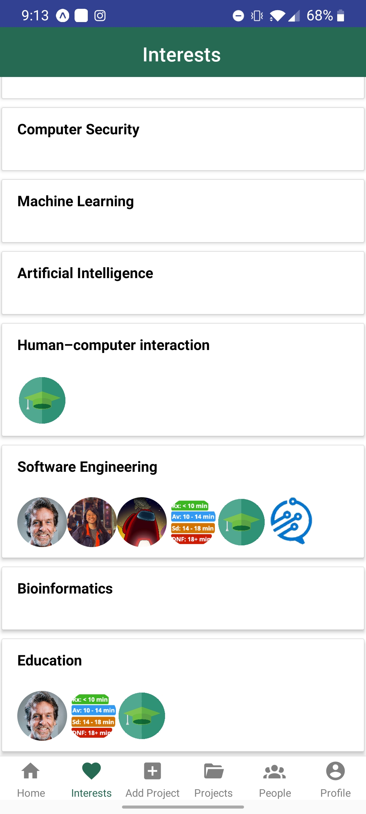
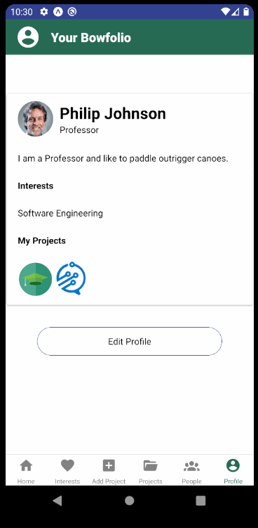

## Table of contents
* [Overview](#overview)
* [User Guide](#user-guide)
* [Developer Guide](#developer-guide)
* [Development History](#project-development-history)
* [Developers](#developers)

## Overview

Bowfolios-Mobile is a mobile version of [Bowfolios](https://bowfolios.github.io/). 
The application is built using:
- [React Native](https://reactnative.dev/) for component-based UI implementation and routing.
- [Native Base](https://nativebase.io/) framework for UI
- [Firebase](https://firebase.google.com/) for database

## User Guide
This section provides a walkthrough of our interface and its current capabilities. The screenshots show the current state of the project. Capabilities not yet implemented are either noted with the screenshot or denoted by the words "Mock Up" by the title. 

### Landing Page

### Projects

### Add Project

### Interests

### Profile

## Developer Guide
1. Download a copy of bowfolios-mobile. You can download either using Github Desktop (recommended) or by extracting the .zip. 

2. Run ``npm install`` to install the dependencies.

3. You can run the project in two ways, using an emulator ([Android Emulator](https://developer.android.com/studio)) or through Expo.

## Project Development History

To track our progress via Milestones:
- [Milestone 1](https://github.com/crypto-cats/bowfolios-mobile/projects/2)
- [Milestone 2](https://github.com/crypto-cats/bowfolios-mobile/projects/3)
- [Milestone 3](https://github.com/crypto-cats/bowfolios-mobile/projects/4)

### Milestone 1: Mockup Ups
The goal of Milestone 1 was to complete the UI implementation for the screens.
- Onboarding
- Profile
- Signin / Signup
- Interests
- Projects

**To see which issues have been finished during M1, please click: [Milestone 1](https://github.com/crypto-cats/bowfolios-mobile/projects/2)**

## Developers
Here are the people who worked on this project:

Eric Rivera: Find his Github <a href = "https://github.com/eric5rivera">here.</a> 

Jennifer Hsu: Find her Github <a href = "http://jhsup.github.io/">here.</a> 

Pauline Peihan Wu: Find her Github <a href = "https://github.com/Pauline-Peihan-Wu/">here.</a> 

