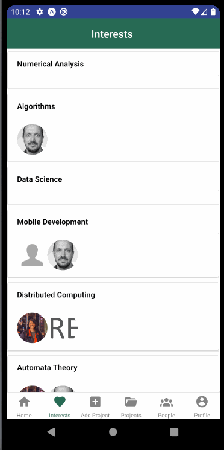

## Table of contents
* [Overview](#overview)
* [User Guide](#user-guide)
* [Developer Guide](#developer-guide)
* [Development History](#project-development-history)
* [Developers](#developers)

## Overview

Bowfolios-Mobile is a mobile version of [Bowfolios](https://bowfolios.github.io/). 
The application is built using:
- [React Native](https://reactnative.dev/) for component-based UI implementation and routing.
- [Native Base](https://nativebase.io/) framework for UI
- [Firebase](https://firebase.google.com/) for database

## User Guide
This section provides a walkthrough of our interface and its current capabilities. The screenshots show the current state of the project. 

### Landing Page

### Projects

### Add Project

### Interests

### People

### Filter

### Edit Profile

### Sign in Redirection

## Developer Guide
1. Download a copy of bowfolios-mobile. You can download either using Github Desktop (recommended
) or by extracting the .zip. As the repo is currently private, please contact one of the
 developers to get the download.

2. Run ``npm install`` to install the dependencies.

3. You can run the project in two ways, using an emulator ([Android Emulator](https://developer.android.com/studio)) or through Expo.

### Database Model
For our database we used Firebase real-time storage and Firebase's Auth API to handle
 authentication for user creation and login.

Our database is similar to the one implemented in [bowfolios](https://bowfolios.github.io/), where we provided pair-wise relations for all 3 primary collections: Profiles, Projects, and
 Interests. They were connected through primary keys such as email, project name, and interest name.

## Project Development History

To track our progress via Milestones:
- [Milestone 1](https://github.com/crypto-cats/bowfolios-mobile/projects/2)
- [Milestone 2](https://github.com/crypto-cats/bowfolios-mobile/projects/3)
- [Milestone 3](https://github.com/crypto-cats/bowfolios-mobile/projects/4)

### Milestone 1: Mockup Ups
The goal of Milestone 1 was to complete the UI implementation for the screens.
- Onboarding
- Profile
- Signin / Signup
- Interests
- Projects

**To see which issues have been finished during M1, please click: [Milestone 1](https://github.com/crypto-cats/bowfolios-mobile/projects/2)**

_Note:_ To access our repo, please contact one of the developers as it is currently private.

### Milestone 2: Database Integrations
The goal of Milestone 2 was to integrate the database so the pages read in from Firebase. The following pages now read in the data:
- Signin / Registration works
- Interests
- Projects
- Prople
- Add Project

**To see which issues have been finished during M2, please click: [Milestone 2](https://github.com/crypto-cats/bowfolios-mobile/projects/3)**

### Milestone 3: Clean Up
The goal of Milestone 3 clean up the UI and fix any bugs that may have arose.
**To see which issues have been finished during M2, please click: [Milestone 3](https://github.com/crypto-cats/bowfolios-mobile/projects/4)**

## Developers
Here are the people who worked on this project:

Eric Rivera: Find his Github <a href = "https://github.com/eric5rivera">here.</a> 

Jennifer Hsu: Find her Github <a href = "http://github.com/jhsuP">here.</a> 

Pauline Peihan Wu: Find her Github <a href = "https://github.com/Pauline-Peihan-Wu">here.</a> 

